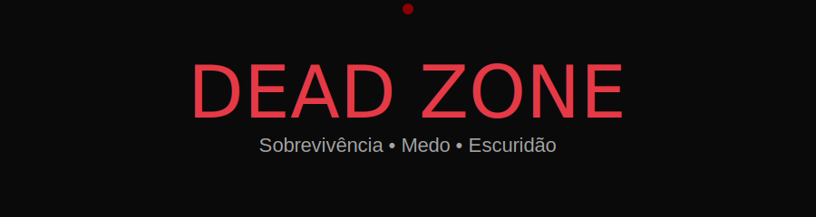
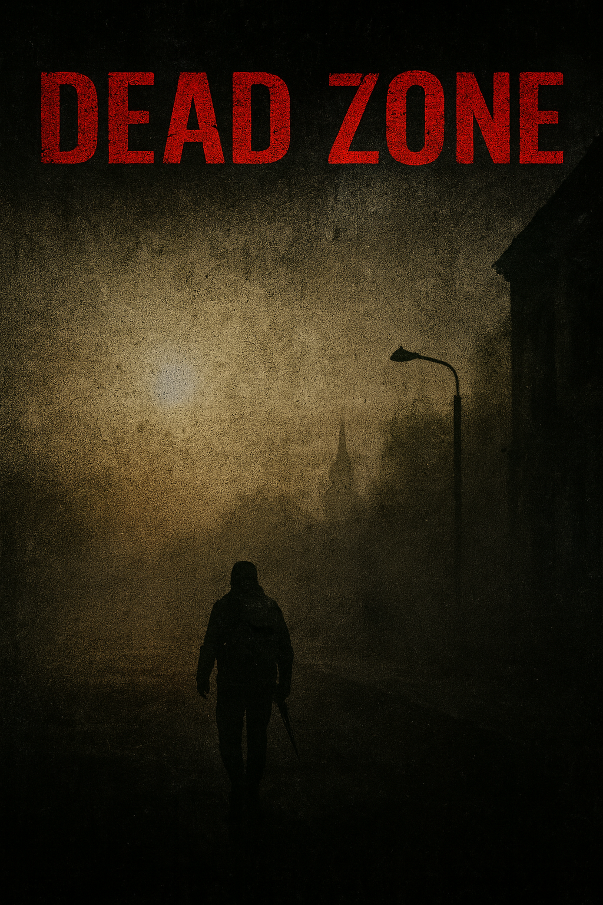

# 🩸 Meu Projeto Estilo DayZ



## 📸 Screenshot do site
> Coloque aqui a imagem do seu site (estilo DayZ)

<p align="center">
  
</p>

---

## 🧟 Sobre o projeto
Este é um projeto inspirado no universo **DayZ**, com foco em:

- 🌑 Ambiente escuro e pós-apocalíptico  
- 🔫 Sobrevivência hardcore  
- 🧭 Interface minimalista porém imersiva  
- 🎮 Visual sombrio para aumentar a tensão  

---

## 🚀 Tecnologias usadas
- HTML / CSS / JS  
- Assets sombrios e minimalistas  
- Animações leves em SVG  
- Otimização para telas desktop + mobile  

---

## 🩹 Status


---

## 🗺️ Como rodar o projeto
```bash
git clone https://github.com/wevertonsantossad/meu-repositorio
cd C:\Users\wever\Desktop\Devclub 1
open index.html
